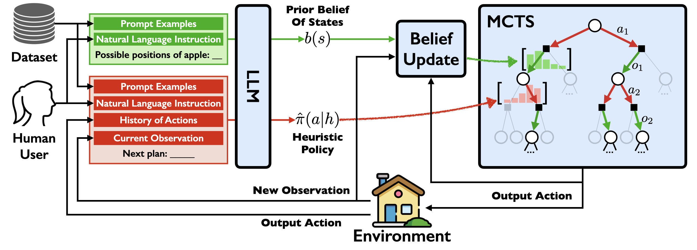

# llm-mcts

This repository contains the code for NeurIPS'23 paper: [Large language models as commonsense knowledge for large-scale task planning](https://arxiv.org/abs/2305.14078). 

We use Large Language Models as both the commonsense world model and the heuristic policy within Monte Carlo Tree Search. LLM's world model provides with MCTS a commonsense prior belief of states for reasoned decision-making. The LLM's heuristic policy guides the search to relevant parts of the tree, substantially reducing the search complexity.



## Updates

* [25 Feb 2024] We have updated the code to use the latest version of the OpenAI API. 

## Cite

```
@inproceedings{
  zhao2023large,
  title={Large Language Models as Commonsense Knowledge for Large-Scale Task Planning},
  author={Zirui Zhao and Wee Sun Lee and David Hsu},
  booktitle={Thirty-seventh Conference on Neural Information Processing Systems},
  year={2023},
  url={https://openreview.net/forum?id=Wjp1AYB8lH}
}
```

## Install

Install the repo: 
```
git clone --recurse-submodules https://github.com/1989Ryan/llm-mcts.git
```

You need to first install virtual home. Please follow with the link at [here](./vh/vh_sim/README_Download.md) as well as the official repository at [here](https://github.com/xavierpuigf/virtualhome) to install.

To intall the dependencies in our method, run
```
pip install -r requirement.txt
```

## Generate Data

We use the code from [here](https://github.com/xavierpuigf/watch_and_help) to generate the data. You can also use the script at [here](./scripts/gene_data.sh) to generate the data. 

To generate data, you need to generate the goal of a domain first, using the command
```
python vh/data_gene/gen_data/vh_init.py \
    --port "{Port Number}" \
    --task {choose your task} \
    --mode {choose one difficulty} \
    --usage {training or testing} \
    --num-per-apartment {a number} 
```

Then, to generate expert data, you need to use
```
python vh/data_gene/testing_agents/gene_data.py \
    --mode {difficulty} \
    --dataset_path {the path to the file generated in the previous step}\
    --base-port {port number}
```

After that, we need to pre-process the expert data
```
python mcts/virtualhome/expert_data.py
```

## Run

Add your openai api key in both `./mcts/virtualhome/llm_model.py` and `./mcts/virtualhome/llm_policy.py`. 

Generate the world model by LLM:
```
python mcts/virtualhome/llm_model.py
```

To run the code for LLM-MCTS, use
```
python mcts/virtualhome/mcts_agent.py \
    --exploration_constant 24 \
    --max_episode_len 50 \
    --max_depth 20 \
    --round 0 \
    --simulation_per_act 2 \
    --simulation_num 100 \
    --discount_factor 0.95  \
    --uct_type PUCT \
    --mode simple \
    --seen_item \
    --seen_apartment\
    --model gpt-3.5-turbo-0125 \
    --seen_comp
```

## Acknowledge

This repository is built upon a number of prior opensource works. 
* Our data generation and testing settings are adapted from https://github.com/xavierpuigf/watch_and_help. 
* The baseline (fine-tuned GPT2 policy) is adapted from https://github.com/ShuangLI59/Pre-Trained-Language-Models-for-Interactive-Decision-Making. Their training code is available in the supplementary materials at https://openreview.net/forum?id=FWMQYjFso-a. 
* GPT3.5 baseline is adapted from https://github.com/huangwl18/language-planner. 
* Our MCTS implementation is adapted from https://github.com/jys5609/MC-LAVE-RL. 
